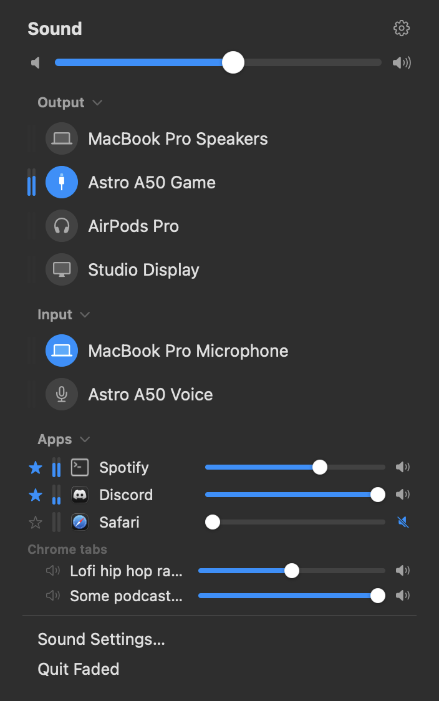
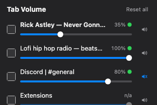

# Faded

A macOS menu bar sound control shaped like the stock Control Center Sound
module, with the parts macOS is missing.

<p align="center">
  
</p>

- **The volume keys work on every output device** — including the ones that
  have no volume control of their own, where macOS greys the slider out and
  F11/F12 do nothing. USB headset base stations (Astro A50 and friends),
  HDMI/DisplayPort audio, plenty of USB DACs.
- **Per-app volume and mute**, with a ⭐ to pin the apps you always want in
  reach. Everything else appears only while it is actually making sound.
- **Output and input devices in one panel**, the way Control Center does it.
- **Level meters** beside each device and app.
- **Hide devices** you never use — they collapse behind "Show More".
- Small Settings window, launch at login.

Deliberately **not** included: volume boost above 100 %, sample-rate switching,
balance, an equalizer, per-app device redirection. If you want those, buy
[SoundSource](https://rogueamoeba.com/soundsource/) — it is excellent and does
far more than this.

> **Status:** young. It runs on the author's machine and does what the list
> above says, but it has not been through a wide range of hardware, and the
> build is signed for local use rather than distribution. Treat it as
> something to read and build yourself, not as a product.

---

## Why

macOS decides whether the volume keys work by asking the *output device* to
change its own volume. Devices like the Astro A50 base station don't implement
a volume control at all — they expect you to use the wheel on the headset — so
macOS greys out the slider and the keyboard keys do nothing. There is no
setting that fixes this, because there is nothing to set.

The only way around it is to put something in the audio path that *does* have a
volume control. That is what Faded is.

## How it works

```
                 ┌──── FadedDriver.driver (HAL plug-in, inside coreaudiod) ────┐
 Spotify ─┐      │  "Faded"  —  the only device it publishes                   │
 Discord ─┼─into ▶  per-app gain ▸ mix ▸ volume/mute ─────▶ shared memory ring │
 Safari  ─┘      │  (has volume + mute controls ⇒ F11/F12 drive it)            │
                 └────────────────────────────────────────────┬───────────────┘
                                                              │ mmap, read-only
                                                   Faded.app  ▼
                                                              │ AUHAL *output* only
                                                              ▼
                                       Astro A50 / speakers / AirPods / USB DAC
```

**Volume keys.** The "Faded" device declares a real volume and mute control, so
macOS drives it from the keyboard, from Control Center and from Sound settings
like any other device. If the *real* target device has hardware volume, Faded
mirrors the value onto it and tells the driver to bypass its own gain — no
double attenuation, and AirPods stem gestures still sync back. If it doesn't,
the driver applies the gain in software. Either way the keys work.

**No input stream anywhere, and no microphone indicator.** The obvious way to
get audio back out of a virtual output device is to publish a second, hidden
*input* device and read from it. Faded did that first, and it works — but macOS
lights the orange microphone indicator for any process holding an audio input
stream, and it draws no distinction between a hidden virtual device and a real
microphone. The indicator was therefore lit for as long as Faded was routing
audio, which is unacceptable for something that never records anything.

So the audio does not travel over an audio device at all. The driver publishes
a POSIX shared-memory ring (`driver/FadedShared.h`) and the app maps it
read-only, pulling frames straight from it inside its output render callback.
Single producer, single consumer, no locks; the read cursor lives in the app's
own memory, which is why the mapping never needs write access. The app opens
only an *output* unit, so no indicator appears — and the whole tap device, plus
a buffer of latency, disappeared with it.

Faded publishes exactly one device. Input is not interposed either: Faded
selects the system input device and drives its hardware controls directly, so
nothing of Faded's can ever turn up in Discord's microphone picker.

**Per-app volume.** The `AudioServerPlugIn` API hands the driver each client's
buffer *before* mixing, along with its pid and bundle id, so gain is applied
there. Helper processes (Chrome Helper, WebKit GPU, Discord Helper) are
resolved back to their owning app for display. Only apps that have recently
produced a signal are listed — otherwise you get every daemon on the system
that happens to hold the device open.

**Meters.** Output level comes free: the driver already has the mixed buffer.
Input level does not exist as a property anywhere in CoreAudio, so it can only
be obtained by opening a capture stream, which is why that meter is opt-in and
off by default — see *Privacy* below.

### AirPlay

**AirPlay speakers are not CoreAudio devices.** A Sonos or an Apple TV shows up
in the stock Sound menu but never appears in the HAL device list; macOS routes
AirPlay above the HAL through a private path. Faded therefore cannot list them
or play to them.

What it does instead is **step aside**. When the system default output moves to
something Faded can't adopt, it disengages rather than fighting to take the
default back — which would otherwise yank you straight off your AirPlay
speaker. The menu says so, and Faded re-engages by itself once a normal device
is selected again. Pick AirPlay in Control Center exactly as you do now; you
just lose per-app volume for as long as you're on it, because nothing of
Faded's is in the path.

## Per-tab volume in the browser

A browser is one audio client as far as macOS is concerned — Chrome and Brave
mix every tab through a single audio service process, and Safari routes all
media through `com.apple.WebKit.GPU`. At the CoreAudio layer there is literally
one stream, so no audio driver, Faded's or anyone else's, can separate tabs.

[`extension/`](extension/) is a companion Chrome/Brave extension that does it
from inside the browser instead: it intercepts `HTMLMediaElement.volume` and
the Web Audio destination in each page, giving every tab its own level. Load it
unpacked from `chrome://extensions` — see [its README](extension/README.md).

<p align="center">
  
</p>

## Privacy

- **Faded does not open the microphone.** Routing audio uses shared memory, not
  a capture stream, so the orange microphone indicator stays off.
- **The input level meter is the one exception, and it is opt-in and off by
  default.** macOS has no way to report a microphone's level without listening
  to it, so that meter does open a capture stream while the menu is on screen —
  and the indicator appears for exactly that long. It measures the peak and
  discards the samples; nothing is recorded or written.
- Bluetooth inputs are never metered: opening a capture stream on an
  AirPods-class device forces the A2DP→HFP profile switch that wrecks playback.
- No network code, no analytics, no accounts. Settings live in
  `~/Library/Preferences/com.andri.faded.plist`.

## Build

Requires Xcode 26, and `brew install cmake xcodegen`.

```bash
make            # driver + app → build/Faded.app
make driver     # just the HAL plug-in
make app        # just the app (embeds the driver)
make clean
```

Builds are ad-hoc signed by default, which works fine. For daily use set a real
signing identity — an ad-hoc signature changes on every build, so macOS treats
each rebuild as a different app and resets its microphone permission and
login-item registration:

```bash
echo 'CODESIGN_ID = Apple Development: you@example.com (TEAMID)' > local.mk
```

`local.mk` is untracked.

### Looking at the UI without installing anything

Debug builds can rasterise the menu to a PNG. No driver, no audio touched:

```bash
./app/build/Build/Products/Debug/Faded.app/Contents/MacOS/Faded \
    --render-menu /tmp/menu.png --expanded --demo
```

(`--demo` substitutes invented device names, which is how the screenshot above
is generated. The Settings window can't be rendered this way — `TabView` and
grouped `Form` are AppKit-backed and come out blank.)

## Install

```bash
make install    # copies build/Faded.app to /Applications and opens it
```

Then click the menu bar icon → **Install Driver…**. That asks for your password
once and restarts `coreaudiod` (about a second of silence). Until you do, Faded
is completely passive — the driver ships inside the app bundle but isn't
installed, and nothing is in your audio path.

## Uninstall

```bash
make uninstall
```

Removes the app, the driver from `/Library/Audio/Plug-Ins/HAL/`, the
preferences, and restarts `coreaudiod`. Or from inside the app: Settings →
General → Uninstall. No launch agents, no daemons, no login items unless you
turn one on.

## Known limitations

- **If Faded isn't running while the driver is installed and "Faded" is the
  default output, there is no sound** — nothing drains the buffer. It restores
  the real device when you quit, but it can't if it crashes; relaunching fixes
  it.
- **Stereo only.** Multichannel content is not passed through.
- **Faded reports the name of the device it is playing to**, so macOS's volume
  HUD, Sound settings and Control Center all show "AirPods Pro" or "Astro A50
  Game" rather than "Faded". The side effect is that macOS's own lists show that
  name twice — once for the real device, once for Faded impersonating it. Faded
  can be told apart by its transport type (`virt`).
  Hiding Faded from those lists would have been tidier, and was tried: **macOS
  refuses to use a device with `kAudioDevicePropertyIsHidden` as the default
  output**, so that idea is settled and the setting is gone.
- Adds roughly 5–15 ms of latency.
- Input volume only works on devices that expose a hardware input control.
- Not suitable for bit-perfect playback chains — there is an extra hop.
- Apple silicon only as configured; the app is universal but the driver builds
  arm64.

## License

MIT — see [LICENSE](LICENSE). Third-party code is listed in
[THIRD-PARTY.md](THIRD-PARTY.md); the driver is built on
[libASPL](https://github.com/gavv/libASPL) by Victor Gaydov, also MIT.
